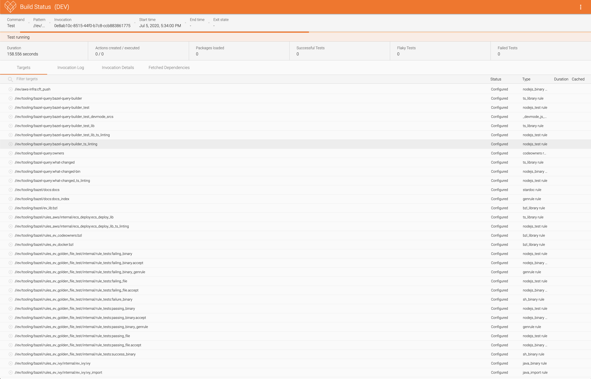

# Bazel Build Dashboard

Build dashboard and service for consuming the [Build Event Protocol](https://docs.bazel.build/versions/master/build-event-protocol.html) 
and displaying meaningful information about a Bazel build or test invocation. It can display information about a previous or currently
running invocation.

### Setup
* Add `--bes_backend=grpc://localhost:5000` to the `.bazelrc`
* `bazel run //src:bin` to run the backend service
* `bazel run //site:devserver` to run the frontend, open http://localhost:8080/

#### Notice 
This is a rewrite of the internal BES Dashboard used at Evertz, this is not a product of Evertz and not officially supported
